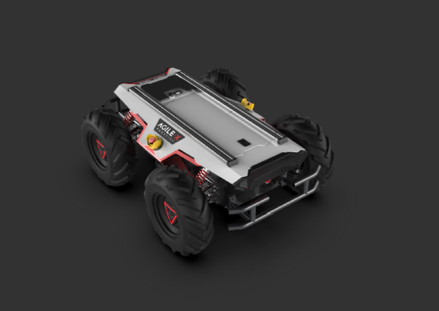

# ROS ~ Robotics course's first assignment
Politecnico di Milano - Accademic Year 2020-2021

The whole project was implemented utilizing `ROS Melodic` on a `Linux Ubuntu 18.04` machine.
## Goals
- Compute odometry using skid steering (approx) kinematics
  - Using Euler and Runge-Kutta integration
  - ROS parameter specifies initial pose
- Use dynamic reconfigure to select between integration method
- Write 2 services to reset the odometry to (0,0) or to a pose (x,y,θ)
- Publish a custom message with odometry value and type of integration

##
> To see the complete requirements -> [Project presentation](Project1_description.pdf)

> To see the complete instructions and description of the package -> [Instructions](Instructions)

(Grade: 100%)

## Team
* [__Alessandro Barbiero__](https://github.com/AlessandroBarbiero)
* [__Andrea Borsatto__](https://github.com/AndreaBorsatto)
* [__Leonardo Cariati__](https://github.com/Leonardo-Cariati)
